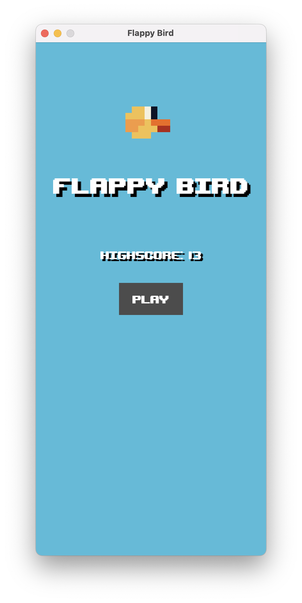

# 🐤 Flappy Bird Clone (LÖVE2D)

A fan recreation of the classic Flappy Bird, developed using [LÖVE2D](https://love2d.org/). Simple, frustrating, and endlessly replayable.

## 📽️ Preview




---

## 🎮 Game Design Overview

Based on:  
[Game Design Analysis of Flappy Bird and Swing Copters](https://medium.com/@thomaspalef/game-design-analysis-of-flappy-bird-and-swing-copters-5c6df9fc10f0)

- **Player has 4 seconds to test controls** before gameplay begins.
- **Physics is consistent**: jump/fall strength and timing are always the same.
- **Challenge** comes from player skill and precision.

---

## 🧠 Core Mechanics

### Player Control
- **Input**: Tap / Click / Spacebar
- **Action**: Bird flaps upward with fixed velocity
- **Gravity**: Constant downward acceleration
- **Constraints**: Cannot fly above screen or fall below ground

### Movement System
- **Bird**: Affected by gravity
- **Pipes**: Move from right to left at constant speed

### Obstacles
- **Pipes**: Vertical pairs with a fixed gap
- **Spacing**: Evenly spaced, with randomized vertical offset
- **Spawn/Despawn**: Off-screen management for performance

---

## 💥 Collision Rules

- **Pipes**: Any contact = game over
- **Ground / Ceiling**: Out-of-bounds = game over
- **Detection**: Axis-Aligned Bounding Box (AABB)

## 🧰 Tech Stack

- **Engine**: [LÖVE2D](https://love2d.org/)
- **Language**: Lua
- **Libraries**:
  - [`rxi/json.lua`](https://github.com/rxi/json.lua) – lightweight JSON parser for Lua

---

## 🚀 Running the Game

### Requirements
- [LÖVE2D 11.x](https://love2d.org/) or newer

### How to Play
1. Download this repo.
2. Run using:
    ```bash
    love .
    ```
3. Or zip the contents and run with LÖVE:
    ```bash
    love path/to/your-zip.zip
    ```

---

## 📜 License

[MIT License](LICENSE)

---

## 🙌 Acknowledgements

- Original game by **Dong Nguyen**
- [Design analysis](https://medium.com/@thomaspalef/game-design-analysis-of-flappy-bird-and-swing-copters-5c6df9fc10f0) by Thomas Palef

---

